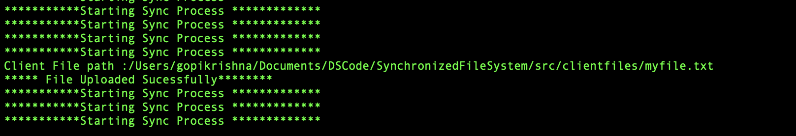

# SYNCHRONIZED STORAGE SERVICE LIKE DROPBOX
The file transfer between the client and the server can be made transparent to users and automatically handled by a helper thread. This creates a Dropbox-like synchronized storage service. Whenever changes are made to the synchronized folder at the client side, e.g., creating a new file, updating a file, or deleting a file, the helper thread will establish a connection with the server and automatically send the corresponding operation to the server to update the folder at the server side. You can configure the helper thread to periodically check if there are changes made to the synchronized folder. If the last update time to a file is later than the last check, the file should be synchronized. To simplify the design, we do not need to consider incremental updates. Thus, if the content of a file is updated, the entire file should be sent to the server to overwrite the original copy at the server.  


## Supporting Operations
* Update a file content should update the server file content
* Creating a new file at client should reflect at server.
* Deleting a file at client should delete the server

## Starting server
1.Open Terminal <br>
2.Go to Downloaded Project Directory

Perform the below operation to start the server

```bash
	1.cd DSCode/SynchronizedFileSystem/src
	2.javac *.java
	3.java FileServer
```
### Server Start Output


## Running Helper Thread Client

Open New Terminal and Run the below command to start the Helper Thread.

```bash
	1.cd DSCode/SynchronizedFileSystem/src
	2.javac *.java
	3.java SyncHelperThread
```
#### OUTPUT


Initially we sync all the files that are present in the `src/clientfiles/` with the server folder `src/serverfiles/`.

#### Tested Output [Initial]


### 1.Create New File

Go to folder `DSCode/SynchronizedFileSystem/src/clientfiles` and create a new file `myfile.txt`, It should update the `myfile.txt` to `DSCode/SynchronizedFileSystem/src/serverfiles/` 

Sync thread observers changes perodically for every 1 Minuite.

We configured 1 minuite for better testing experience.

#### OUTPUT[Newly Created]


### 1.Update File And Delete File

Go to folder `DSCode/SynchronizedFileSystem/src/clientfiles` and update a file `myfile.txt`, It should update the changes of `myfile.txt` to `DSCode/SynchronizedFileSystem/src/serverfiles/` 

Go to folder `DSCode/SynchronizedFileSystem/src/clientfiles` and delete a file `myfile.txt`, It should delete the file `myfile.txt` from `DSCode/SynchronizedFileSystem/src/serverfiles/` 


#### OUTPUT[update and Deleted]

